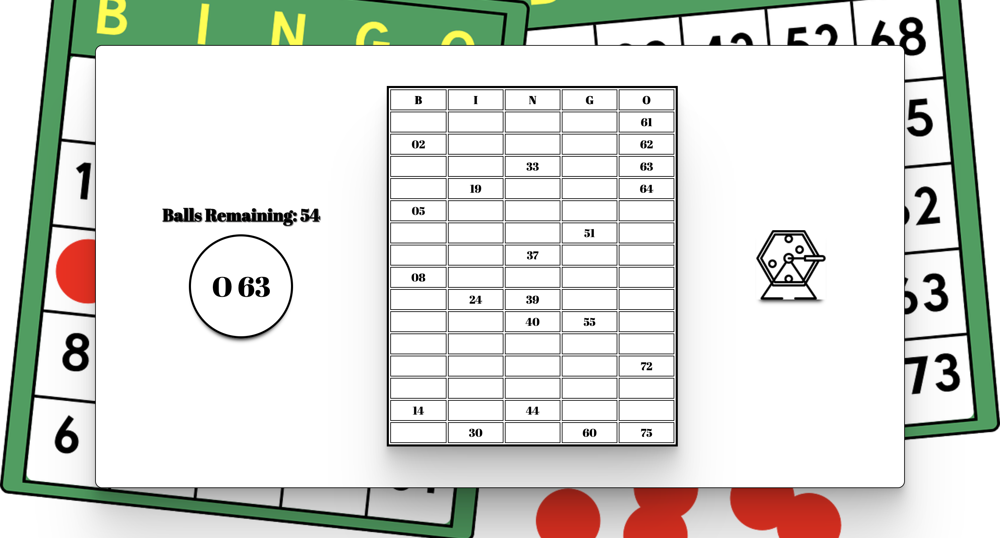

# Bingo App

A Javacript-based desktop application that acts as a virtual bingo ball cage machine, that picks random bingo balls displays those that are already chosen on a grid.

## User Story

- AS A user wanting to host a virtual bingo night,
- I WANT to be able to display the balls that are being chosen for all players,
- SO THAT we can play bingo and social distance at the same time.

## Overview

This is a very simple application that allows you to host a virtual bingo night, and display the balls for the players as they are chosen. My friend wanted to throw a bingo birthday party while we were quarantining, so I made this desktop app to display over Zoom as we all played bingo in our own homes.

It utilizes vanilla Javascript, Google Fonts, and Image from Pixabay , and icons from Flaticon designed by [Nikita Golubev](https://www.flaticon.com/authors/nikita-golubev "Nikita Golubev")

## Utilizing the App

- Experience the deployed app: [Here](https://jsmithxyz.github.io/bingo/ "Here")
- Upon entering the app, the user will be served a blank bingo grid that will display all possible bingo choices, from B1-O75 when chosen from the ball cage.
- To begin a game, simply click on the Ball Cage icon.
- Above the current ball, Balls Remaining in that particular session will be displayed.
- The application is mobile friendly, and can be used on all devices.

## Demonstrations

## Tech used

- Vanilla Javscript
- HTML/CSS
- Google Fonts
- Image from Pixaby
- Icons from Nikit Golubev

## Future Development

- Add an interactive Bingo Card so you can play the whole game on your desktop

## Contributers

- **Jordan Smith** - _Full-Stack Development_ - [Jordan Smith](https://github.com/jsmithxyz "Jordan Smith")
